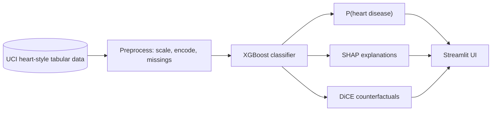

<div align="center">

# Heart Risk Advisor
Supervised ML for cardiovascular risk estimation — XGBoost on tabular clinical data, with SHAP and counterfactual tooling in a Streamlit demo.


**Supervised ML for cardiovascular risk estimation** — XGBoost on tabular clinical data, with SHAP and counterfactual tooling in a Streamlit demo.

[](https://www.python.org/)
[](https://streamlit.io/)
[](https://xgboost.readthedocs.io/)
[](./LICENSE)
[](https://github.com/GabryeleSantoro/heart-risk-advisor/commits)
[](https://github.com/GabryeleSantoro/heart-risk-advisor)

</div>

---

## Table of contents

|                                         |                                              |
| :-------------------------------------- | :------------------------------------------- |
| [Overview](#overview)                   | [Dataset (EDA)](#dataset-eda)                |
| [Model & stack](#model--stack)          | [Model performance](#model-performance)      |
| [Architecture](#architecture)           | [Quick start](#quick-start)                  |
| [Project layout](#project-layout)       | [Disclaimer](#disclaimer)                    |

---

## Overview

This project explores **supervised learning** for **cardiovascular risk estimation** from routine clinical and stress-test style variables. The goal is to relate a small set of patient measurements to a binary outcome that indicates whether angiographic heart disease is present—using the same kind of framing found in classic public benchmarks, **not as a substitute for a doctor**.

### What it is about

The core question is whether a model can learn patterns linking **demographics, blood pressure, cholesterol, ECG summaries, and exercise-test results** to a **disease / no-disease** label. The app is meant for **learning and demonstration**: it shows an estimated probability and tools that help interpret how the model uses the inputs, so limitations and uncertainty stay visible.

### What it is based on

The work is grounded in the widely used **UCI heart disease** tradition—tabular data with **thirteen input features** and a binary target derived from clinical follow-up (angiography). Values follow the usual coding for that family of datasets (including sentinel codes for unknown entries where applicable). Any insight applies to **this dataset and modelling setup**, not to individual medical decisions.

<details>
<summary><strong>Dataset & codings (expand)</strong></summary>

Thirteen engineered input features plus a binary target; unknowns use the usual sentinel codes from that dataset family. See `data/heart-disease.csv` and `src/preprocessing.py` for column definitions and loading logic.

</details>

---

## Dataset (EDA)

Exploratory analysis lives in [`notebook/eda.ipynb`](notebook/eda.ipynb). A machine-readable summary is [`reports/eda_summary.json`](reports/eda_summary.json) — run the notebook through the **last cell** to regenerate it.

### Shape and label

| Quantity | Value |
| :-- | --: |
| Rows | 303 |
| Input features | 13 (binary target separate) |
| Duplicate rows | 1 |

The binary **target** codes **0** = no angiographic disease, **1** = disease present. The positive class is slightly more frequent (**165** vs **138**), i.e. about **54.5%** positive — a **mild** imbalance (absolute deviation from 50% ≈ **0.045**; positive:negative ratio ≈ **1.20**).

### Missing values and UCI sentinels

This copy of the CSV has **no `?` tokens** in the feature columns; preprocessing still treats `?` as missing when loading. Following the UCI convention, **unknown** is sometimes encoded as **`ca` = 4** (5 rows) and **`thal` = 0** (2 rows); [`src/preprocessing.py`](src/preprocessing.py) maps those codes to **NaN** before imputation.

### Linear association with the target (Pearson _r_)

On raw numeric codings, the strongest correlations with the label include exercise-related and angina signals (exact values in `eda_summary.json`):

| Feature | Approx. _r_ (vs target) |
| :-- | --: |
| `exang` (exercise angina) | −0.44 |
| `cp` (chest pain type) | +0.43 |
| `oldpeak` (ST depression) | −0.43 |
| `thalach` (max HR) | +0.42 |
| `ca` (vessels colored) | −0.39 |

These are **descriptive only** (mixed discrete/continuous codings); they do not replace modelling.

### Stratification and class weights

The EDA notebook checks a **stratified** train/test split (**25%** hold-out, `random_state=42`) so train and test positive rates stay near the global rate (~**54.6%** / ~**53.9%**). **Modelling** uses a **20%** test split with the same seed — see [Model performance](#model-performance). For reference, `sklearn.utils.class_weight` “balanced” weights are about **1.10** (class 0) and **0.92** (class 1).

---

## Model & stack

Predictions come from a **gradient-boosted decision tree** classifier (**XGBoost**), preceded by standard preprocessing (handling missing codes, scaling numeric fields, and encoding categorical variables). That choice balances flexibility on tabular data with interpretability hooks compatible with common explanation methods.

| Layer               | Choice                                           |
| :------------------ | :----------------------------------------------- |
| **Classifier**      | XGBoost (gradient-boosted trees)                 |
| **Explainability**  | SHAP (e.g. waterfall-style views in the app)     |
| **Counterfactuals** | DiCE (`dice-ml`) for “what-if” style suggestions |
| **UI**              | Streamlit (`app/app.py`)                         |
| **Notebooks**       | Exploratory and modelling work under `notebook/` |

The project is **not** validated for clinical deployment; treat outputs as **research-style estimates** only.

> [!WARNING]
> **Not medical advice.** This repository is for education and research. Do not use it for diagnosis, treatment, or any clinical decision.

> [!NOTE]
> Insights are specific to **this benchmark framing and preprocessing**. External validation would be required before any real-world use.

A small **local web interface** is included if you want to explore predictions and explanations interactively.

---

## Model performance

Metrics are produced in [`notebook/modeling.ipynb`](notebook/modeling.ipynb) and summarized in [`reports/model_benchmark.json`](reports/model_benchmark.json) (run the notebook through the **last cell** to regenerate that file). Each CV fold records **accuracy, precision, recall, F1, and ROC-AUC**—the README table highlights ROC-AUC and F1; see the JSON (or the technical report in [`paper/heart_risk_advisor_study.tex`](paper/heart_risk_advisor_study.tex)) for the full set.

**Experimental setup:** stratified train/test split (**242 / 61** rows, `test_size=0.2`, `random_state=42`). Each model uses the shared preprocessing pipeline from `src/preprocessing.py`. The benchmark uses **5-fold stratified cross-validation** on the training fold only.

### Benchmark with default hyperparameters

Five models are compared with library defaults; ranking below is by **mean CV ROC-AUC** (higher is better). Values are means ± one standard deviation across folds.

| Rank | Model               | ROC-AUC (mean ± std) | F1 (mean ± std) |
| ---: | :------------------ | :------------------- | :-------------- |
|    1 | **SVM** (RBF)       | **0.896 ± 0.036**    | 0.825 ± 0.056   |
|    2 | Logistic regression | 0.889 ± 0.037        | 0.839 ± 0.069   |
|    3 | Random Forest     | 0.887 ± 0.041        | 0.830 ± 0.044   |
|    4 | **XGBoost**         | 0.872 ± 0.052        | 0.812 ± 0.073   |
|    5 | k-nearest neighbors (k-NN) | 0.870 ± 0.050        | 0.813 ± 0.052   |

`GridSearchCV` (scoring **ROC-AUC**, same CV splitter) is then run on the **top two** from this table—here **SVM** and **logistic regression**—to study sensitivity to hyperparameters. **XGBoost is not part of that top-two sweep** (it ranked fourth under defaults).

### Tuned pipelines used in the repo

**Independently** of the top-two search, [`notebook/modeling.ipynb`](notebook/modeling.ipynb) always runs **focused** `GridSearchCV` fits for **XGBoost** and **logistic regression** so both pipelines can be saved under `models/` (SHAP/DiCE and a linear baseline). The **~0.892** / **~0.899** CV ROC-AUC figures are the best scores from **those** dedicated grids (`tuned_pipelines_saved` in the JSON), not from tuning **SVM** (the top default model). Exact values and parameters: [`reports/model_benchmark.json`](reports/model_benchmark.json).

On the **held-out test set**, logistic regression achieves a higher **ROC-AUC** than XGBoost (**~0.930 vs ~0.858**) and slightly higher accuracy (**~0.820 vs ~0.787**). The **Streamlit app loads only the tuned XGBoost pipeline** for predictions and explanations. That is a **scope choice**, not a limitation of SHAP or DiCE: SHAP also supports linear models (e.g. `LinearExplainer`), and DiCE works with generic sklearn estimators; we standardized the UI on **exact tree SHAP** (`TreeExplainer`) and the DiCE configuration tested against this booster. The saved **logistic regression** artifact remains the primary **linear baseline** in the notebooks.

**Global SHAP table** (mean |SHAP| by logical feature, training split) is exported to [`reports/shap_global_summary.json`](reports/shap_global_summary.json). Regenerate it from the repo root with:

```bash
python scripts/export_shap_global_summary.py
```

> [!NOTE]
> Single small test sets are noisy; the gap between CV and hold-out (and between models) should not be over-interpreted. Nothing here constitutes clinical validation.

---

## Architecture



The diagram reflects **what the app runs**: a single tuned boosting pipeline into the UI. A tuned **logistic regression** model is also saved under `models/` and used in notebooks as a baseline; it is not wired into Streamlit.

---

## Quick start

```bash
python -m venv .venv
source .venv/bin/activate   # Windows: .venv\Scripts\activate
pip install -r requirements.txt
streamlit run app/app.py
```

<details>
<summary><strong>Dependencies at a glance</strong></summary>

`scikit-learn`, `xgboost`, `shap`, `dice-ml`, `pandas`, `matplotlib`, `seaborn`, `streamlit`, `kaggle` — see [`requirements.txt`](./requirements.txt) for the canonical list.

</details>

---

## Project layout

| Path        | Role                                                           |
| :---------- | :------------------------------------------------------------- |
| `app/`      | Streamlit UI and i18n                                          |
| `src/`      | Preprocessing and shared feature definitions                   |
| `data/`     | CSV used for training / demo                                   |
| `models/`   | Serialized model artifacts                                     |
| `notebook/` | Jupyter workflows (modelling, explainability, counterfactuals) |
| `paper/`    | Technical report (`heart_risk_advisor_study.tex`) and EDA figure script |
| `reports/`  | Exported metrics: `model_benchmark.json`, `eda_summary.json`, `shap_global_summary.json` |
| `scripts/`  | `export_shap_global_summary.py` — regenerates logical-feature SHAP summary JSON |

---

## Disclaimer

This software is provided **as-is** for learning and demonstration. It does not replace professional medical judgment.
