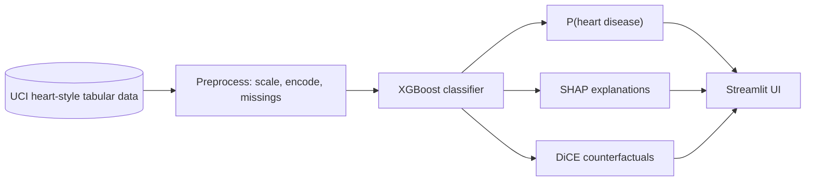

<div align="center">

# Heart Risk Advisor

**Supervised ML for cardiovascular risk estimation** — XGBoost on tabular clinical data, with SHAP and counterfactual tooling in a Streamlit demo.

[](https://www.python.org/)
[](https://streamlit.io/)
[](https://xgboost.readthedocs.io/)
[](./LICENSE)
[](https://github.com/GabryeleSantoro/heart-risk-advisor/commits)
[](https://github.com/GabryeleSantoro/heart-risk-advisor)

</div>

---

## Table of contents

| | |
| :--- | :--- |
| [Overview](#overview) | [Model & stack](#model--stack) |
| [Architecture](#architecture) | [Quick start](#quick-start) |
| [Project layout](#project-layout) | [Disclaimer](#disclaimer) |

---

## Overview

This project explores **supervised learning** for **cardiovascular risk estimation** from routine clinical and stress-test style variables. The goal is to relate a small set of patient measurements to a binary outcome that indicates whether angiographic heart disease is present—using the same kind of framing found in classic public benchmarks, **not as a substitute for a doctor**.

### What it is about

The core question is whether a model can learn patterns linking **demographics, blood pressure, cholesterol, ECG summaries, and exercise-test results** to a **disease / no-disease** label. The app is meant for **learning and demonstration**: it shows an estimated probability and tools that help interpret how the model uses the inputs, so limitations and uncertainty stay visible.

### What it is based on

The work is grounded in the widely used **UCI heart disease** tradition—tabular data with **thirteen input features** and a binary target derived from clinical follow-up (angiography). Values follow the usual coding for that family of datasets (including sentinel codes for unknown entries where applicable). Any insight applies to **this dataset and modelling setup**, not to individual medical decisions.

<details>
<summary><strong>Dataset & codings (expand)</strong></summary>

Thirteen engineered input features plus a binary target; unknowns use the usual sentinel codes from that dataset family. See `data/heart-disease.csv` and `src/preprocessing.py` for column definitions and loading logic.

</details>

---

## Model & stack

Predictions come from a **gradient-boosted decision tree** classifier (**XGBoost**), preceded by standard preprocessing (handling missing codes, scaling numeric fields, and encoding categorical variables). That choice balances flexibility on tabular data with interpretability hooks compatible with common explanation methods.

| Layer | Choice |
| :--- | :--- |
| **Classifier** | XGBoost (gradient-boosted trees) |
| **Explainability** | SHAP (e.g. waterfall-style views in the app) |
| **Counterfactuals** | DiCE (`dice-ml`) for “what-if” style suggestions |
| **UI** | Streamlit (`app/app.py`) |
| **Notebooks** | Exploratory and modelling work under `notebook/` |

The project is **not** validated for clinical deployment; treat outputs as **research-style estimates** only.

> [!WARNING]
> **Not medical advice.** This repository is for education and research. Do not use it for diagnosis, treatment, or any clinical decision.

> [!NOTE]
> Insights are specific to **this benchmark framing and preprocessing**. External validation would be required before any real-world use.

A small **local web interface** is included if you want to explore predictions and explanations interactively.

---

## Architecture



---

## Quick start

```bash
python -m venv .venv
source .venv/bin/activate   # Windows: .venv\Scripts\activate
pip install -r requirements.txt
streamlit run app/app.py
```

<details>
<summary><strong>Dependencies at a glance</strong></summary>

`scikit-learn`, `xgboost`, `shap`, `dice-ml`, `pandas`, `matplotlib`, `seaborn`, `streamlit`, `kaggle` — see [`requirements.txt`](./requirements.txt) for the canonical list.

</details>

---

## Project layout

| Path | Role |
| :--- | :--- |
| `app/` | Streamlit UI and i18n |
| `src/` | Preprocessing and shared feature definitions |
| `data/` | CSV used for training / demo |
| `models/` | Serialized model artifacts |
| `notebook/` | Jupyter workflows (modelling, explainability, counterfactuals) |

---

## Disclaimer

This software is provided **as-is** for learning and demonstration. It does not replace professional medical judgment.
